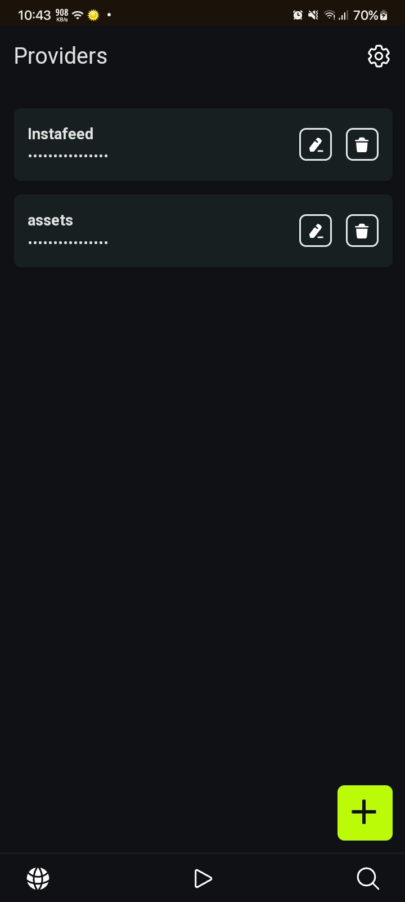
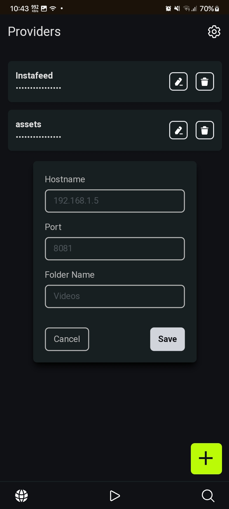
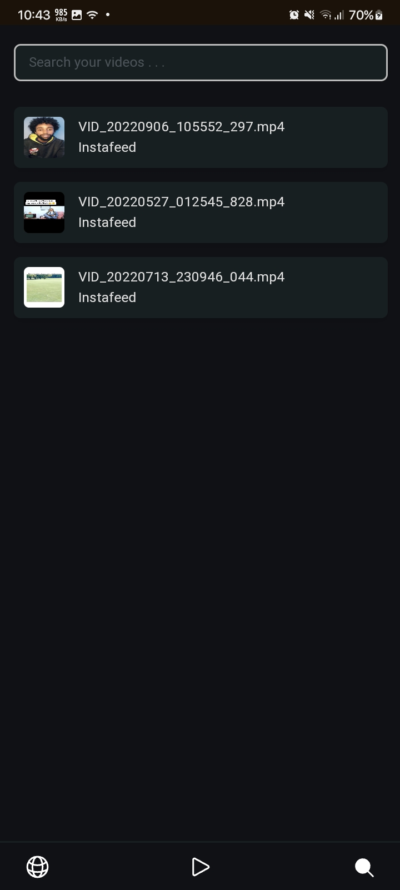

> # Vertideo

    
    
A web app to watch your local videos like tiktok.

## This is how it works . . .

- You host the videos with a HTTP hosting file manager like [MiXplorer](https://play.google.com/store/apps/details?id=com.mixplorer.silver&hl=en_US&pli=1).

- Then this web app will get them and show you your videos like tiktok.

## Technologies Used

- ReactJS
- Node with Express

## Features

- PWA Support
- Adding multiple providers (Fancy name for the folders you hosted)
- Data Persistence for the Providers (localstorage)

## To-Do

- Video Liking
- Light Mode
- Settings Page (UI is done, it needs to be functional)
- Needs heavy optimization (Slow loading)
- IntersectionObserverAPI not working on mobiles

## Some Screenshots

